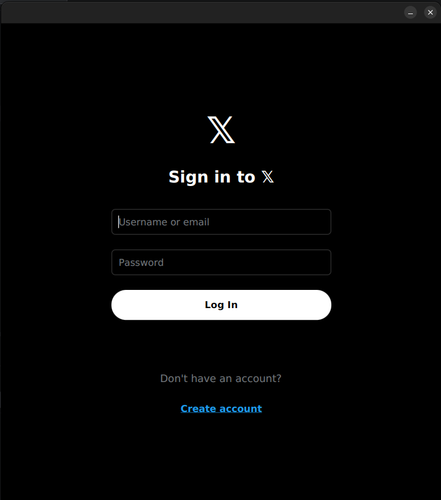
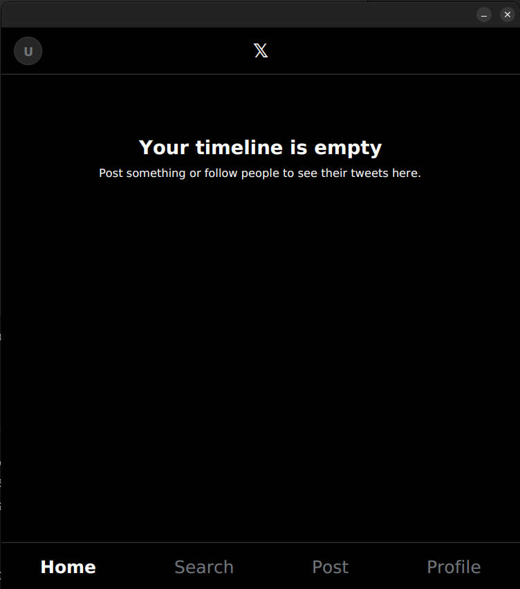
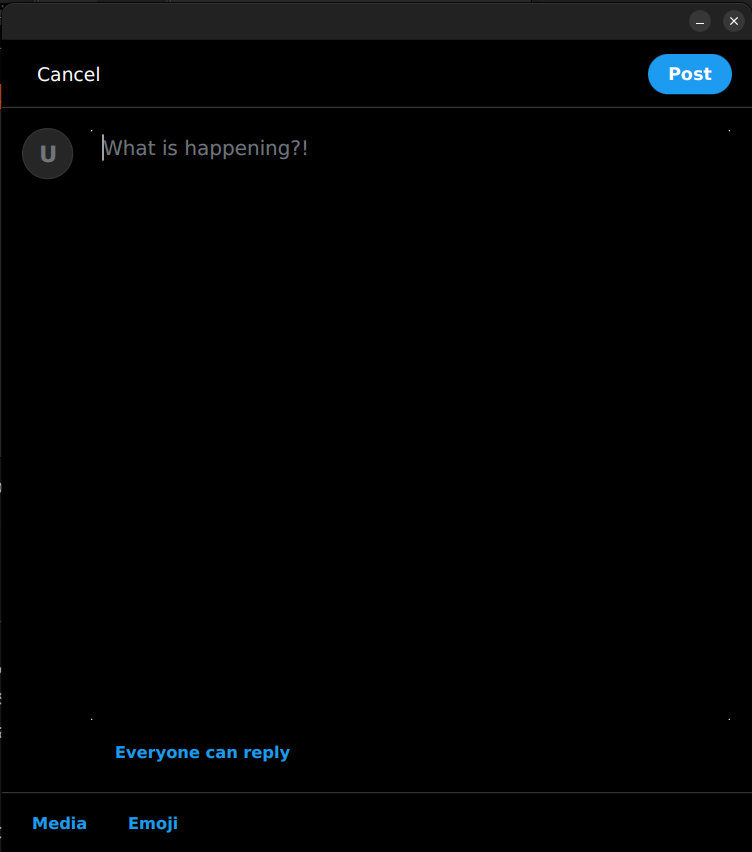
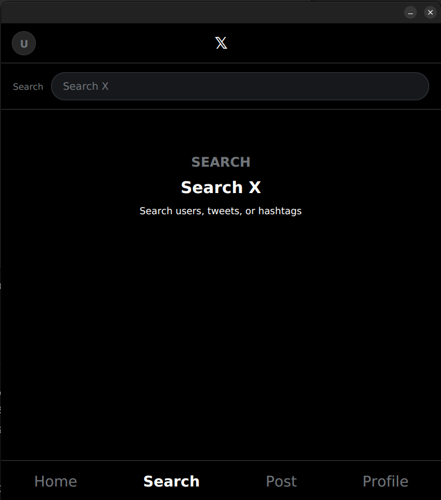
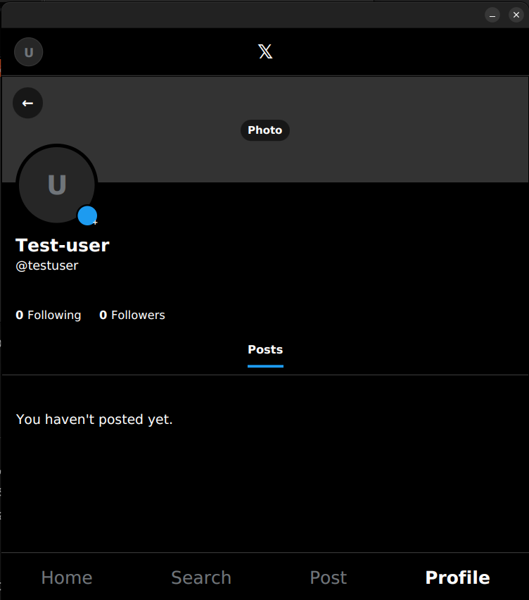
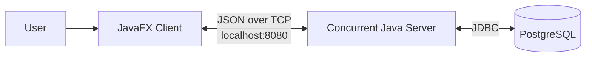

# Twitter Clone

A desktop social-networking application inspired by X/Twitter, built with JavaFX, Java sockets, and PostgreSQL.

## Table of Contents

- [Description](#description)
- [Features](#features)
- [Technology Stack](#technology-stack)
- [Usage](#usage)
- [Demo and Visuals](#demo-and-visuals)
- [Credits](#credits)
- [Changelog](#changelog)
- [Contact](#contact)

## Description

Twitter Clone is a client-server desktop application for sharing short posts and interacting with other users. It was created to demonstrate how a social platform can be structured across a JavaFX interface, a concurrent socket server, a JSON-based request/response protocol, and a relational database.

The project gives users a familiar place to publish tweets, discover content, and build connections while providing developers with a practical example of layered Java application design.

## Features

- Account registration, login, logout, and secure BCrypt password hashing
- Personalized feed and user profiles
- Create and delete tweets, replies, and reposts
- Like and unlike tweets
- Follow and unfollow users
- Search for users, tweets, and hashtags
- Edit profile details, avatar, and banner
- Attach images, videos, and animated GIFs to tweets
- Emoji picker and relative tweet timestamps
- Live new-tweet events for connected followers
- Responsive navigation between the feed, search, compose, and profile views

## Technology Stack

- Java 21
- JavaFX 21 and FXML
- Maven
- PostgreSQL and JDBC
- TCP sockets with a Gson-based JSON protocol
- BCrypt for password hashing

## Usage

### Prerequisites

Install the following before running the project:

- JDK 21
- Maven 3.9 or later
- PostgreSQL

### 1. Clone the repository

```bash
git clone https://github.com/ihadisharifi/twitter-clone.git
cd twitter-clone
```

### 2. Configure PostgreSQL

Create the database and application user from `psql`:

```sql
CREATE USER twitterapp WITH PASSWORD 'pass';
CREATE DATABASE twitterclone OWNER twitterapp;
```

Then update `src/main/resources/db.properties` with your local credentials:

```properties
db.url=jdbc:postgresql://localhost:5432/twitterclone
db.user=twitterapp
db.password=pass
```

The server automatically applies `src/main/resources/db/schema.sql` when it starts.

### 3. Build the project

```bash
mvn clean compile
```

### 4. Start the server

Run `server.network.Server` from your IDE. The server listens on `localhost:8080`.

Alternatively, run it with Maven:

```bash
mvn org.codehaus.mojo:exec-maven-plugin:3.5.0:java \
  -Dexec.mainClass=server.network.Server
```

### 5. Start the desktop client

In a second terminal, run `client.Launcher` from your IDE, or use Maven:

```bash
mvn org.codehaus.mojo:exec-maven-plugin:3.5.0:java \
  -Dexec.mainClass=client.Launcher
```

Register an account, sign in, and use the navigation controls to compose tweets, browse the feed, search, or view profiles. The client currently connects to `localhost:8080`; change the constants in `ServerConnection` to use a remote server.

## Demo and Visuals

### Application Screenshots


#### Login




#### Home Feed




#### Compose Tweet




#### Search




#### User Profile




### Architecture




## Credits


This project uses the following open-source libraries and resources:

- [OpenJFX](https://openjfx.io/) for the desktop interface and media playback
- [Gson](https://github.com/google/gson) for JSON serialization
- [PostgreSQL JDBC Driver](https://jdbc.postgresql.org/) for database access
- [Favre BCrypt](https://github.com/patrickfav/bcrypt) for password hashing

The product concept and interface are inspired by X/Twitter. This is an independent educational project and is not affiliated with or endorsed by X Corp.

## Changelog

### 1.0.0 (in development)

- Added JavaFX authentication, feed, search, compose, and profile views
- Replaced temporary in-memory storage with PostgreSQL DAOs
- Added tweets, replies, reposts, likes, follows, hashtags, and profile editing
- Added image, video, GIF, avatar, and banner media support
- Added socket-based client-server communication and live follower events
- Improved navigation, UI helpers, and database-backed controllers

## Contact

For questions, support, or bug reports:

- GitHub: [@ihadisharifi](https://github.com/ihadisharifi)
- Issues: [github.com/ihadisharifi/twitter-clone/issues](https://github.com/ihadisharifi/twitter-clone/issues)
